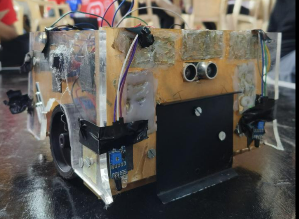

# SumoBot 🤖  
**Autonomous Sumo Robot with Real-Time Opponent Tracking and Obstacle Avoidance**

---

## 📌 Project Overview

SumoBot is an autonomous robot designed and programmed for competitive Sumo wrestling events. It features real-time opponent tracking and obstacle avoidance to excel in aggressive, responsive movement on the arena.

---
## Photos
Watch the demo video here:  

---

## 🎥 Demo Video

---

## ⚙️ Technical Highlights

- **Platform:** Arduino  
- **Languages:** C++  
- **Sensors:** Ultrasonic Sensors for obstacle detection, IR Sensors for opponent tracking  
- **Actuators:** Motor drivers for precise and aggressive motor control  
- **Algorithms:** Real-time sensor data processing for tracking and navigation

---

## 🚀 Achievements

- Advanced to the **Semi-Finals** at **Robotex India Championship 2024**  
- Represented Robotics Club Pune at the national level  
- Optimized motor control and sensor integration for peak performance and responsiveness

---

## 🛠️ Built With

- Arduino IDE  
- Ultrasonic & IR Sensors  
- Motor Driver Modules  
- Embedded C++ programming

---

> ⚡ SumoBot blends smart sensing and aggressive control to dominate the ring with precision and speed.
